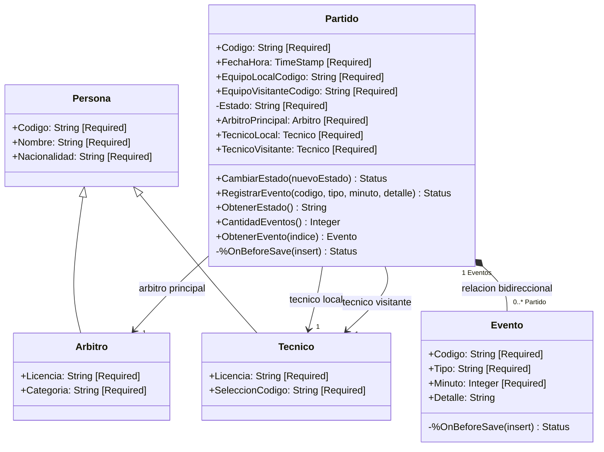

# Modelo de objetos

El modulo modela el partido como una entidad con estado y comportamiento. Los eventos dependen del partido. Los arbitros y tecnicos poseen identidad propia y comparten los datos de una persona.

## Decisiones

- `Persona` es una clase persistente abstracta. `Arbitro` y `Tecnico` representan especializaciones estables.
- `Partido` y `Evento` forman una relacion padre-hijo. Un evento no tiene sentido fuera de su partido.
- `Evento.Partido` tiene un indice porque es el extremo que apunta al padre.
- Los estados permitidos son `Programado`, `EnJuego` y `Finalizado`.
- Las unicas transiciones permitidas son `Programado -> EnJuego` y `EnJuego -> Finalizado`.
- Solo un partido `EnJuego` puede recibir eventos.
- `Estado` es privado y las transiciones deben pasar por `CambiarEstado()`.
- `RegistrarEvento()` es la interfaz de escritura del agregado. La validacion de `Evento` tambien rechaza un guardado directo si el partido no esta `EnJuego`.
- El minuto debe estar entre 0 y 130.
- Los codigos `ARG`, `BRA` y `F2030` mantienen continuidad con la muestra sintetica de Neo4j. El modulo no implementa sincronizacion entre motores.

## Limite del agregado

El guardado parte de `Partido`. IRIS persiste el arbitro, los tecnicos y los eventos alcanzables como una transaccion. El agregado no incluye todos los equipos, jugadores o partidos del torneo.
