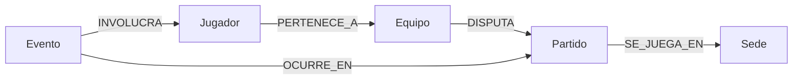

# Modelo de grafo del Fixture 2030

## Diagrama

## Nodos

| Etiqueta | Identificador | Propiedades relevantes | Origen |
| --- | --- | --- | --- |
| `Equipo` | `id`, UUID v5 del Hito 4 | `codigo`, `nombre`, `confederacion` | MongoDB, Hito 4 |
| `Jugador` | `id`, UUID v5 del Hito 4 | `nombre`, `apellido`, `posicion`, `dorsal`, `equipoCodigo` | MongoDB, Hito 4 |
| `Partido` | `id`, codigo `F2030-NNN` | `fecha`, `hora`, `fase` | Muestra academica del Hito 5 |
| `Sede` | `id`, codigo `SED-NNN` | `nombre`, `ciudad`, `pais`, `region` | Muestra academica del Hito 5 |
| `Evento` | `id`, codigo `EVT-NNN-NN` | `tipo`, `minuto`, `detalle`, `datosSinteticos` | Muestra academica del Hito 5 |

MongoDB sigue siendo la fuente principal de las fichas completas de equipos y jugadores. Neo4j conserva solo las propiedades necesarias para identificar nodos, inspeccionar resultados y recorrer relaciones.

## Relaciones y cardinalidades

| Relacion | Direccion | Cardinalidad esperada | Propiedades | Motivo |
| --- | --- | --- | --- | --- |
| `PERTENECE_A` | `Jugador` a `Equipo` | Cada jugador pertenece a un equipo; un equipo tiene 24 jugadores | Sin propiedades | Permite navegar del plantel al fixture |
| `DISPUTA` | `Equipo` a `Partido` | Cada partido tiene dos equipos; un equipo puede disputar varios partidos | `condicion`: local o visitante | Representa la participacion y su condicion |
| `SE_JUEGA_EN` | `Partido` a `Sede` | Cada partido usa una sede; una sede recibe varios partidos | Sin propiedades | Separa la programacion del lugar fisico |
| `OCURRE_EN` | `Evento` a `Partido` | Cada evento ocurre en un partido; un partido tiene varios eventos | Sin propiedades | Conserva el contexto deportivo del evento |
| `INVOLUCRA` | `Evento` a `Jugador` | Cada evento de la muestra tiene un protagonista; un jugador puede intervenir en varios eventos | `rol`: protagonista | Permite recorrer desde una accion hasta la ficha compartida |

Las direcciones siguen la lectura principal del modelo: un jugador pertenece a un equipo, un equipo disputa un partido, un partido se juega en una sede y un evento ocurre en un partido. Cypher permite recorrer una relacion en sentido contrario cuando una pregunta lo necesita.

## Integridad e indices

Se definieron restricciones de unicidad para `id` en las cinco etiquetas. Estas restricciones impiden duplicar entidades durante una carga repetida y crean indices para identificar cada nodo.

Se agregaron tres indices vinculados con operaciones concretas:

- `jugador_equipo_dorsal` localiza al protagonista de un evento y permite buscar un jugador dentro de un plantel.
- `partido_fecha` filtra y ordena la programacion por fecha.
- `evento_tipo` recupera eventos de un tipo, por ejemplo goles.

No agregamos indices para todas las propiedades. Cada indice aumenta el trabajo de escritura y debe responder a una consulta identificada.
